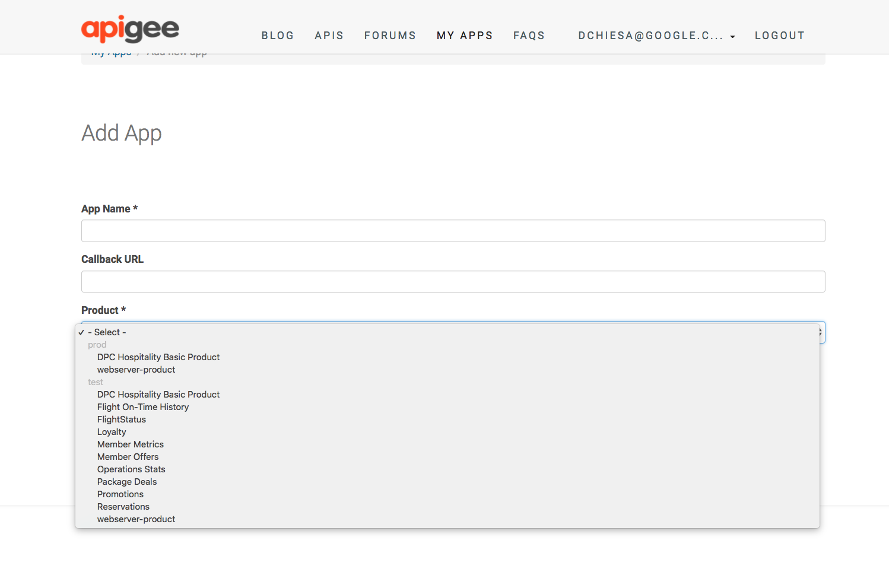

# API Product Group by Environment

This module provides grouping of API Products by environment, in the dropdown select box presented to the user.

It works by implementing a hook for the devconnect_developer_apps_edit_form .  The hook modifies the form to provide "Grouped" sublists of API Products.





Without this module, the list might be rendered as:

```
  - Product 1
  - Product 2
  - Product 3
  - Product 4
```

When using this module, the list of API Products it might look like this:


```
 test
  - Product 1
 stage
  - Product 2
  - Product 3
 prod
  - Product 4
```

In HTML, this grouping is rendered with optgroup tags.


## Installing

You should download all the files for this module into a directory named sites/all/modules/custom/apiproduct_groupby_env .
Then enable the module as normal, in the Drupal Module administration panel.


## Configuration

There is  no administrative configuration for this module. It just works.


## Usage

No special usage instructions.


## Notes

1. This module won't do anything if the presentation you select is "checkboxes" and not a dropdown select.

2. Some products may appear in more than one environment. In that case, this module will show those products more
   than once in the resulting dropdown. This may or may not be what you want.


## Support Status

This module is not part of Drupal.
This module is also not a supported part of the Apigee Edge Drupal-based developer portal.

This module is open-source software. If you need assistance, you can try inquiring on [The Apigee Community Site](https://community.apigee.com).
There is no service-level guarantee for responses to inquiries regarding this module.

